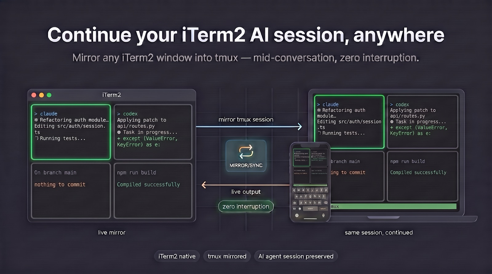

# itermux-bridge

[English](README.md) · **简体中文**

把 **iTerm2** 桥接进**真正的 tmux 协议**。把原生 `tmux` 客户端 attach 到一个活着的
iTerm2 session，或者用 `tmux send-keys` / `list-panes` 驱动 iTerm2。



```bash
tmux -S ~/.itermux/default.sock attach        # see & type into an iTerm2 session
tmux -S ~/.itermux/default.sock list-panes    # enumerate iTerm2 sessions as panes
tmux -S ~/.itermux/default.sock send-keys -t %3 'ls' Enter
```

先记住这张表，后面的内容都基于它 —— **iTerm2 tab = tmux window**，并且注意
“session” 在两边的含义正好相反：

| tmux | iTerm2 |
|---|---|
| session `$N` | window |
| window `@N` | tab |
| pane `%N` | session（tab 内的一个分屏） |

→ [安装](#install) · [首次运行](#first-run) · [前缀键](#supported)

## 为什么会有这个项目

**通过 SSH 连到一台 Mac，和坐在它面前，是两个不同的世界，前者受限得多。**
你从 SSH 会话里启动的一切都继承了那个受限世界。这个 bridge 让你转而伸手进入桌面
会话 —— 你驱动的是*已经跑在那里*的终端，拥有登录用户的完整权限。

SSH 登录是 **`Background`** 会话，桌面则是 **`Aqua`** 会话。下面是同一台机器、
同一个签名身份、同一条命令 —— 一次走 SSH，一次通过这个 bridge 送进一个活着的
iTerm2 pane：

```console
$ ssh mac 'launchctl managername'
Background
$ ssh mac 'codesign -s $IDENTITY /tmp/f'
/tmp/f: errSecInternalComponent                    # ← signing fails

$ tmux -S ~/.itermux/default.sock send-keys -t %3 \
      'launchctl managername; codesign -s $IDENTITY /tmp/f' Enter
Aqua
rc=0                                               # ← signed, no prompt
```

原因在于**登录 keychain**。它不会为 `Background` 会话解锁，所以
`security show-keychain-info` 在 SSH 下报 *“User interaction is not allowed”*，
而桌面会话报 `no-timeout`。注意 `security find-identity` 在 SSH 下仍然能*列出*
你的证书 —— 真正失败的是**私钥**。这也是为什么错误表现为一个语焉不详的
`errSecInternalComponent`，而不是一个一眼就懂的权限错误。

任何需要读取已存凭据的东西都继承了这个问题：`codesign`、带签名身份的
`xcodebuild`、公证，以及从 keychain 读 token 的工具。

**还有多少东西会坏，取决于你的机器。** 受 TCC 保护的资源（Screen Recording、
Accessibility、Automation、Files & Folders）是按*应用*授权的，而 `sshd` 派生出的
进程并不是你授权的那个应用 —— 但如果你已经给 `sshd` 授予了 Full Disk Access，
其中很多在 SSH 下也能用。keychain 是唯一无论如何都坏着的，因为它卡在会话类型上，
而不是卡在某个你能授予的权限上。

### AI 编码 agent 这个场景

这才是这个项目真正的出发点。Claude Code、Codex、Gemini CLI 这类 agent 是长时间
运行的进程，它们要编译、签名、跑模拟器、读凭据 —— 而且一跑就是几个小时，所以
SSH 断线不该把它们弄死。用纯 SSH 启动它们，上面那堵签名/keychain 的墙就在前面
等着，而错误信息（`errSecInternalComponent`）对真正的原因没有任何提示。

改在 Mac 本机的 iTerm2 里启动它们 —— 在那里它们有一个真正的桌面会话 —— 然后
**从任何地方用普通 `tmux` 客户端 attach 过去**。detach（或者掉线）关掉的只是你的
视图：agent 是 iTerm2 里的一个进程，所以它带着完整的桌面权限继续跑，你重新 attach
回去，它还在你离开时的地方。

```bash
ssh mac                                        # from your laptop, phone, iPad…
tmux -S ~/.itermux/default.sock a -t %3        # attach to the agent's pane
# Ctrl-B d to detach; it keeps running with desktop privileges
```

你在这些从没被 tmux 启动过、也压根不知道 tmux 存在的 session 上，获得了 tmux 的
使用体验（detach/attach、pane 导航、scrollback、copy-mode）。

### 它还适合做什么

- **从另一台机器盯着一次长时间的构建或测试**，不用在 Mac 上一直开着终端。
- **用 shell 脚本驱动 iTerm2**：用 `list-panes` 找到跑着某条命令的 pane，用
  `send-keys` 驱动它。
- **结对 / 演示** —— 多个客户端可以同时 attach。

### 它对你的要求

Mac 必须**处于登录状态并且 iTerm2 正在运行** —— 那个桌面会话正是全部意义所在，而
bridge 只能投射已经存在的 session。如果 iTerm2 退出，你 attach 着的客户端也会跟着
断开。所以它是对 SSH 的补充而不是替代：用 SSH 连上机器，进去之后用 bridge 够到
桌面会话。

## 工作原理

它不是 tmux，也没有包装 tmux。它是一个 Python 服务端，实现了 tmux 的
客户端↔服务端线路协议（Unix socket 上的 imsg 分帧，配合 `SCM_RIGHTS` 传递 fd），
并把它映射到 iTerm2 的 Python API 上。

    tmux client  ──imsg/SCM_RIGHTS──▶  itermux-bridge  ──WebSocket──▶  iTerm2
                 ◀──── your tty fd ───┘  (renders + forwards keys)

概念映射就是开头那张表：iTerm2 window → tmux session `$N`，tab → window `@N`，
分屏 → pane `%N`。只有 **pane** 在两边含义相同。实际效果：

```
$ tmux -S ~/.itermux/default.sock ls
$0: 9 windows (attached)

$ tmux -S ~/.itermux/default.sock list-windows
0: zsh (1 panes) [162x59] @0
7: claude* (2 panes) [162x59] @7 (active)

$ tmux -S ~/.itermux/default.sock list-panes -a
0:7.0: [162x29] [vim]    %7
0:7.1: [162x29] [claude] %8 (active)
```

`-t` 接受 tmux 支持的每一种写法 —— `%8`（pane id）、`@7`（window id → 它的活动
pane）、`7.1`（window.pane 索引）、`$0:7.1`，或者裸的 `8`。指不到任何东西的
target 是**错误**，绝不会悄悄回退到当前聚焦的 pane。

**你 attach 到什么，取决于你 target 什么：**

```bash
tmux -S ~/.itermux/default.sock a -t @0    # the whole TAB — every pane, with dividers
tmux -S ~/.itermux/default.sock a -t %2    # one PANE, full-screen
tmux -S ~/.itermux/default.sock a          # the focused pane
```

target 一个 window（`@N`，或者 `$0:1`）会把这个 tab 的整个分屏布局合成到你的终端上
—— bridge 会遍历 iTerm2 的分屏树（`tab.root`），按每个 pane 的真实大小等比缩放到
你的网格上，并在它们之间画出方框分隔线。一个 6 pane 的 tab（2 列 × 3 行）渲染成：

```
 pane A            │ pane D
───────────────────┼───────────────────
 pane B            │ pane E     ← active: its border is green
───────────────────┼───────────────────
 pane C            │ pane F
```

**活动 pane 的边框会高亮为绿色**（就是 tmux 自己 `pane-active-border-style` 的
默认值），这样你能看出击键会落到哪里。你用 `Ctrl-B o` / 方向键在 pane 之间移动时，
它会跟着走。

target 一个 pane（`%N`）则只把那一个渲染成全屏。

不带 `-t` 时，bridge 渲染当前聚焦的那个 tab —— 但绝不会渲染客户端自己所在的那个
终端。把一个 pane attach 到它自己会形成反馈回路（重绘改变了 pane，又触发下一次
重绘），所以它会被自动跳过；如果你用 `-t` 明确点名它，则会报错拒绝。

ID（`$N`/`@N`/`%N`）在第一次见到时分配，并持久化到 `~/.itermux/state.json`，所以
某个 iTerm2 tab 重启后仍然保持同一个编号。索引（`0:` / `7.1` 这些列）是按位置来的，
和 tmux 一样。

<a id="install"></a>

## 安装

```bash
python3 -m venv .venv && .venv/bin/pip install iterm2
.venv/bin/python -m itermux_bridge.cli install
.venv/bin/python -m itermux_bridge.cli doctor
```

打开 **iTerm2 → Settings → General → Magic → Python API**，然后重启 iTerm2。
bridge 作为 AutoLaunch 脚本运行，所以它的生命周期和 iTerm2 完全一致。

```
itermux-bridge install | uninstall | status | logs [-f] | doctor
```

<a id="first-run"></a>

### 首次运行

attach 任何东西之前，先确认 bridge 已经起来了 —— `list-panes` 不需要 tty，所以它
要么打印出你真实的 iTerm2 分屏，要么告诉你哪里出了问题：

```console
$ tmux -S ~/.itermux/default.sock list-panes -a
0:0.0: [162x59] [zsh]    %0
0:7.1: [162x29] [claude] %8 (active)
```

*No such file or directory* 表示 bridge 没在跑 —— 执行 `doctor`，并检查上面说的
Python API 设置。没有报错但输出为空，说明它在跑，只是 iTerm2 没有打开任何窗口。

然后 attach 到它列出的某个 pane，再 detach 出来：

```bash
tmux -S ~/.itermux/default.sock a -t %8    # attach to that pane
# ... Ctrl-B d to detach. The pane keeps running in iTerm2.
```

detach 只关掉你的视图 —— iTerm2 里没有任何东西被停掉，所以拿一个正在干活的 pane
来试也是安全的。值得加一个 shell 别名，毕竟每条命令都要带上 socket 路径：

```bash
alias it='tmux -S ~/.itermux/default.sock'
it list-panes -a && it a -t %8
```

<a id="supported"></a>

## 已支持

attach/detach、实时屏幕流、键盘输入、鼠标（滚轮/点击/拖拽）、prefix 绑定、
`send-keys`、`list-panes`、`list-windows`、`list-sessions`、`has-session`、
`new-session`、`detach-client`、`select-window` / `next-window` /
`previous-window`、`display-message`。

**创建东西。** `new-session` 会打开一个新的 iTerm2 **window** 并 attach 上去 ——
当你 SSH 进来、还没有哪个 pane 值得接管时很有用。在已 attach 的客户端内部，
`Ctrl-B c` 创建一个 **window**（即一个 iTerm2 tab）。

```bash
it new                    # open a window and attach to it
it new -d -s build        # open one on the Mac, don't attach
id=$(it new -d -P)        # ...and capture its id, as in tmux
```

tmux 的这些 flag 中它接受 `-d`、`-s <name>` 和 `-P`（单独的 `-d` 什么都不打印，
和 tmux 完全一致）。其余的 —— `-c`、`-x`/`-y`、`-n`、`-A`、`-e`、`-E` —— 会
**报错拒绝**而不是被忽略，因为 iTerm2 是按你的默认 profile 打开窗口的，一个被
悄悄忽略的 `-c /path` 会让你身处错误的目录却浑然不觉。

注意它和「杀掉」之间的不对称：bridge 会按请求创建 window，但拒绝销毁它们，因为
它并不拥有那些不是自己启动的终端的生命周期。

**Prefix 绑定**（`Ctrl-B`），映射到等价的 iTerm2 操作：

| 键 | 动作 | iTerm2 |
|---|---|---|
| `d` | detach | — |
| `c` | 新建 window | 新建 iTerm2 tab（并跟随它） |
| `z` | 缩放/还原当前 pane | Maximize Active Pane（真正的开关） |
| `o` | 下一个 pane | 激活下一个分屏 |
| 方向键，`h` `j` `k` | 按方向选择 pane | `select_pane_in_direction` |
| `Ctrl`+方向键 | 调整 pane 大小 | `preferred_size` + `update_layout` |
| `0`–`9` | 跳到第 N 个 window | 激活那个 tab |
| `l` / `;` | 上一个 window / 上一个 pane | — |
| `"` / `%` | 水平 / 垂直分屏 | `async_split_pane` |
| `x` | kill pane | 关闭该分屏 |
| `PgUp` / `PgDn` | 翻阅该 pane 的 scrollback | — |
| `n` / `p` | 下一个 / 上一个 window（tab） | 激活相邻的 tab |
| `[` | copy-mode（选择文本） | — |
| `m` | 切换鼠标上报（`set -g mouse`） | — |
| `Ctrl-B` | 发送一个字面量 `Ctrl-B` | — |

**翻阅 pane 的历史。** 笔记本键盘大多没有 PgUp/PgDn，所以有好几种入口：

| | |
|---|---|
| `Ctrl-B u` / `Ctrl-B e` | 上翻 / 下翻一页 —— 最短，不需要按修饰键 |
| `Ctrl-B Ctrl-U` / `Ctrl-B Ctrl-D` | 同上，vi 风格 |
| `Ctrl-B PgUp` / `Ctrl-B PgDn` | 如果你确实有这两个键 |

在 copy-mode 内（`Ctrl-B [`）：`Ctrl-U`/`Ctrl-D` 翻半页，`b`/`Ctrl-F` 翻整页，
`g`/`G` 到最顶 / 最底 —— 在屏幕边缘按住方向键会持续拉取更多历史。

在 window 模式下只有*活动* pane 会滚动 —— scrollback 是按 pane 分开的 —— 而它周围
的分屏布局保持不动。敲任何字符都会跳回实时画面。

（你终端自带的滚动条帮不上忙：它存的是我们的重绘帧，不是 pane 的历史。历史存在
iTerm2 里，按需拉取。）

**选择文本。** 通常你根本不需要 copy-mode：把鼠标留给你的终端（默认如此），直接
双击选词或者拖拽即可 —— 原生选择，原生剪贴板。

copy-mode 是给键盘操作准备的：`Ctrl-B [`，然后用方向键/`hjkl` 移动，`v`/空格开始
选择，`y`/回车复制，`q`/Escape 退出；`0`/`$` 跳到行首行尾，`g`/`G` 到顶/到底。
和 tmux 一样，一次选择被限制在单个 pane 内。复制的文本通过 OSC 52 进入你的
**系统剪贴板**，而不是 bridge 内部的粘贴缓冲区。

开启 `Ctrl-B m`（鼠标打开）后，按下-拖动-松开同样可以选择并复制。

iTerm2 没有 zoom API，但它暴露了 `Maximize Active Pane` 这个**菜单项**，其
`checked` 状态让 `Ctrl-B z` 成为一个真正的开关，而不是有去无回的单程票。

**鼠标 —— 默认关闭，和 tmux 完全一样。** bridge 在 attach 时*不会*请求鼠标上报，
所以**鼠标仍然归你的终端**：双击选词、拖拽选择、右键、复制到系统剪贴板 —— 你在
tmux 之外享有的全部原生行为，原样保留。

这正是真 tmux 里选择文本感觉正常的全部原因：它的默认值是 `mouse off`，所以鼠标
事件根本到不了它那里。向终端请求 `\033[?1000h` 会把鼠标从终端*夺走*，然后一个
手搓的 copy-mode 就不得不重新实现选择功能 —— 而且做得很糟（没有双击选词，没有
右键菜单）。

当你确实需要时，`Ctrl-B m` 会把上报**打开** —— 此时滚轮翻阅 iTerm2 的 scrollback，
而 TUI（vim、Claude CLI）能收到它的点击。代价是终端自身的选择功能，和 tmux 里的
`set -g mouse on` 一样。

如果你要打开它，请小心：当上报关闭时 iTerm2 报的是
`mouseReportingMode = **-1**` 而不是 `0` —— 用真值判断会把它当成“已启用”，从而
悄悄搞坏 scrollback。

未实现：control mode（`-CC`）、`.tmux.conf` 解析、命令提示符（`Ctrl-B :`）和
`choose-*` 选择器（`Ctrl-B s` / `w`）、预设布局（`Ctrl-B space`）。
`rename-window` 和 `break-pane` 有绑定，但会说明它们为什么跑不了：前者需要一个能
输入的命令提示符，后者没有对应的 iTerm2 API。杀掉 session 是故意拒绝的 —— bridge
并不拥有那些终端的生命周期，所以 `kill-session` 改为 detach。绘制工作由客户端的
终端完成（普通模式，不是 control mode），所以任何终端上的任何 tmux 版本都能用。

完整的、对照 tmux 默认绑定表的差距分析见 [MISSING.md](MISSING.md)，分层结构见
[ARCHITECTURE.md](ARCHITECTURE.md)。

## 协议笔记

线路格式要求的、又容易搞错的那些点 —— 全部对照 tmux 3.7b 源码和一个真实客户端
验证过：

- **`IMSG_FD_MARK`** —— imsg `len` 字段的最高位（`0x80000000`）标记“有一个 fd 通过
  SCM_RIGHTS 随行”。真实长度是 `len & ~IMSG_FD_MARK`。漏掉它，每个带 fd 的帧都会
  被解析成约 2 GB 的长度。
- **`peerid` 的低字节携带 `PROTOCOL_VERSION`**（tmux 3.x 是 8）。不匹配 →
  服务端必须回复 `MSG_VERSION` 并挂断。
- **客户端的 tty 归服务端所有。** `client.c` 只在 control mode 下调用
  `cfmakeraw()`；普通 attach 时是*服务端*对收到的 fd 做 `tcsetattr()`。跳过这一步，
  行规程会把每一次击键都吃掉。
- **`MSG_COMMAND` 的载荷是 `struct msg_command { int argc; }` + 紧接着打包的 argv**，
  不是一个裸的 NUL 分隔列表 —— 直接切分整个载荷会得到一个多余的 `\x01` 首参数。
- **`MSG_EXIT` 必须携带 4 字节的退出状态。** 空载荷会让客户端停留在默认值 1，于是
  一次干净的 detach 在 `$?` 看来像是失败。
- **只向真正 attach 的客户端（有真实 tty 的）发送 `MSG_READY`。** 发给一次性命令
  客户端，它会走 attached 的代码路径，在命令输出后面附上一个多余的 `[exited]`。
- **iTerm2 对未初始化的单元格返回 `\0`。** 原样写出去会打乱客户端的解析器并导致
  连接断开；把它们渲染成空格。
- **`cursor_coord.y` 是该 session 整个历史中的绝对行号**（我们在 59 行的网格上见过
  `y=705`）。要用 `windowed_coord_range.start.y` 去重新定基，那才是你拿到的第一行
  的绝对行号 —— *不是* `number_of_lines_above_screen`，后者经常是 0，会把光标死死
  钉在最后一行。搞错这个，TUI 渲染看着没问题，但光标位置是错的。
- **`get_screen_contents()` 返回的行数可能多于客户端的行数** —— 渲染*尾部*
  （用户正在看的部分），而不是头部。
- **`line.string` 按字符索引，而终端按单元格推进。** 一个 CJK 字形或 emoji 占一个
  索引、*两*列（实测：一行 146 个字符宽 187 个单元格）。用 `text[:cols]` 裁剪会超出
  宽度，行被折行，活动背景色沿着屏幕往下糊。要按显示宽度裁剪。
- **`\033[2K` 用当前背景色来擦除**，所以每擦一行之前要先重置 SGR，否则上一行的背景
  色会把下一整行涂满。
- **绝不要用清整屏（`\033[2J`）来重绘。** 它会在新帧落地之前把终端闪成空白 ——
  每次击键都能看见的闪烁。改为逐行写（在填充每一行之前紧接着擦除它），这样上一帧
  更高时残留的内容会被覆盖掉，而屏幕从不会变空。
- **把每一帧包在同步更新里**（`\033[?2026h` … `\033[?2026l`）。一整帧有几十 KB，
  超过 pty 一次 `write()` 能接受的量，因此会被拆成多次写入，否则终端会渲染出画到
  一半的画面。要在*每一条*返回路径上都发出结束序列 —— 没闭合的同步块会冻住客户端
  的显示。

## 测试

```bash
for t in tests/test_*.py; do .venv/bin/python "$t" || break; done
```

| | |
|---|---|
| `test_handshake.py` | 真实 tmux 二进制：握手、fd 传递、detach |
| `test_command.py` | 一次性命令客户端，target 解析 |
| `test_codec_limits.py` | imsg 分帧：`IMSG_FD_MARK`、超大帧、fd 泄漏 |
| `test_ansi.py` | `CellStyle` → SGR 重新编码，CJK 单元格宽度 |
| `test_layout.py` | 分屏树 → 网格矩形、分隔线 |
| `test_mapper.py` | iTerm2 对象 → `$N`/`@N`/`%N`，id 持久化 |
| `test_prefix.py` | prefix 状态机：分片读取、`bind -r` 重复 |
| `test_mouse.py` | SGR 1006 解码、滚轮/拖拽 |
| `test_copymode.py` | 选择、pane 边界、scrollback 翻页 |
| `test_newsession.py` | `new-session` 创建 window 而不是 attach |

前两个用**真实的 `tmux` 二进制**通过 PTY 对着 bridge 跑 —— 线路格式错了它们就会
失败。其余都是纯逻辑测试，不需要 iTerm2 也不需要 socket，这正是分层带来的好处。

`tests/test_live_iterm.py` 是单独的：它需要一个真实的、跑着 bridge 的 iTerm2，
所以不属于上面那一轮扫描。
